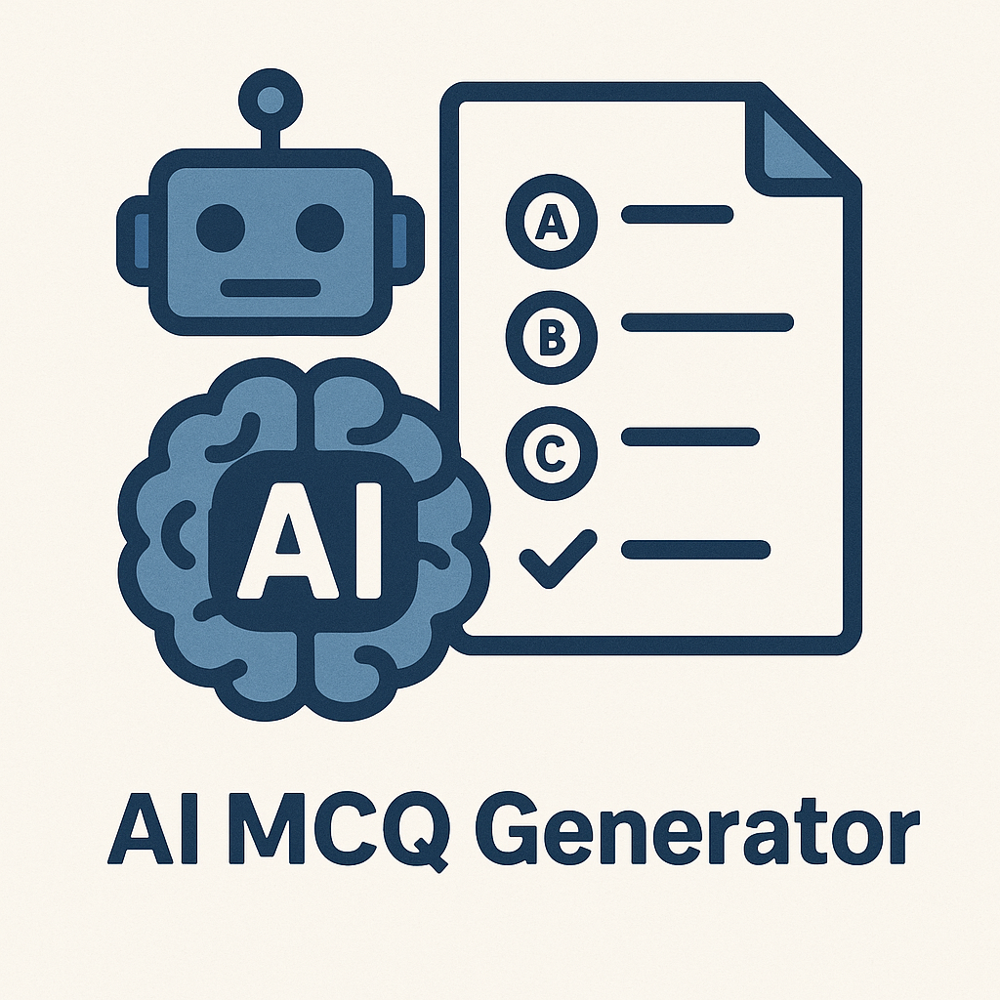

# Data Science Portfolio - [Silent Muzinde](https://github.com/silentmuzinde/Data-Science-Portfolio)!

This portfolio is a compilation of all the Data Science and Data Analysis projects I have undertaken for academic, self-learning, work related (as project descriptions only), and hobby purposes. It also showcases my achievements, skills, and certificates, and is updated on a regular basis.

**Email**: [silentmuzinde@gmail.com](mailto:silentmuzinde@gmail.com)  
**LinkedIn**: [linkedin.com/silentmuzinde](https://www.linkedin.com/in/silent-muzinde-317035186/)

---

## 🚀 Pinned Projects
<table> 
  <tr> 
    <td width="30%"> 
       
    </td> 
    <td> 
      <a href="https://github.com/silentmuzinde/Data-Science-Portfolio/tree/main/Loan-Eligibility-Prediction"><strong>Loan Eligibility Prediction Model</strong></a>  
      A logistic regression model that predicts loan eligibility based on features like income, loan amount, credit history, employment status, and asset value, etc. It includes a simple, interactive Streamlit web interface for real-time predictions.
       <strong>Technologies:</strong> Python, Streamlit, Scikit-learn, Pandas 
    </td> 
  </tr>

  <tr> 
    <td width="30%">  
         
    </td>
    <td>  
      <a href="https://github.com/silentmuzinde/Data-Science-Portfolio/tree/main/Carlories-Burnt-Prediction-Model"><strong>Calories Burnt Prediction Model</strong></a>  
      A machine learning model that predicts calories burnt based on features such as activity type, duration, intensity, and user metrics. This project utilizes a machine learning pipeline for efficient data processing and includes a FastAPI backend for real-time predictions. 
       <strong>Technologies:</strong> Python, FastAPI, Streamlit, Scikit-learn, Pandas, Machine Learning Pipelines 
    </td>
  </tr>

  <tr> 
    <td width="30%"> 
       
    </td> 
    <td> 
      <a href="https://github.com/silentmuzinde/Data-Science-Portfolio/tree/main/AI-MCQ-Generator"><strong>AI MCQ Generator</strong></a>  
      A Flask-based Gen-AI tool that generates multiple-choice questions (MCQs) from uploaded content such as PDF, DOCX, or TXT files. It leverages LLaMA-3 via LangChain and the Groq API to understand the content and craft relevant questions and answer options. The tool includes a simple web interface and supports exporting the generated questions to PDF. 
       <strong>Technologies:</strong> Python, Flask, LangChain, Groq API, Prompt Engineering 
    </td> 
  </tr> 

  <tr> 
    <td width="30%"> 
       
    </td> 
    <td> 
      <a href="https://github.com/silentmuzinde/Data-Science-Portfolio/tree/main/AI-Resume-Analyser"><strong>AI Resume Analyser</strong></a>  
      A Flask-based Resume Analyser that uses ChatGPT/Groq API and LangChain to automatically evaluate resumes against job descriptions. It extracts key skills, experience, and qualifications from both documents and computes a relevance score, helping recruiters or applicants quickly assess fit. The app provides real-time feedback and supports interactive comparison via a simple web interface. 
       <strong>Technologies:</strong> Python, Flask, LangChain, Groq API, ChatGPT, Prompt Engineering 
    </td> 
  </tr>
</table>

    
## 💼 Workplace / Real World Projects

### 1. 📊 **Projects Management Power BI Dashboard**
Developed an interactive Power BI dashboard to monitor project progress, track milestone completion, and analyze budget utilization across multiple departments.
- **Technologies:** Power BI, SQL, Excel

### 2. 📊 **Stores Stock Management Power BI**
Built a stock management dashboard visualizing stock levels, reorder points, consumption trends, and warehouse movements—enhancing procurement decisions.
- **Technologies:** Power BI, Excel, Data Modeling

### 3.📊 **Plant Reliability & Maintenance Dashboard**
Designed a maintenance performance tracker to log servicing schedules, monitor equipment downtime,plant availability, and evaluate repair efficiency.
- **Technologies:** Power BI, Excel, KPI Visualization

### 4.📊 **Transport & Fleet Utilization Dashboard**
Created an Excel-based reporting tool for analyzing fleet usage, trip frequency, hire costs, fuel consumption, and transport efficiency metrics.
- **Technologies:** Microsoft Excel, Pivot Tables, Data Validation

## Micro Projects
- **[Meal Recipes App (Flutter)](https://github.com/silentmuzinde/Meals_App)**:  In this Flutter Meals App project, I created an app that provides recipes for various meals based on categories like Italian, French,etc.
- **[M-Pesa Daraja USSD Integration (NodeJs)](https://github.com/silentmuzinde/mpesa_payment_integration)**:  In this project, I implemented M-Pesa payment integration to facilitate seamless transactions within an application.
- **[Inventory System (PowerApps)](https://github.com/silentmuzinde/PowerAppsInventorySystem)**  In this project, I developed an inventory management system using PowerApps to streamline tracking and managing stock levels effectively.

## Core Competencies

- **🛠️ Methodologies**: Machine Learning, Explainable AI, A/B Testing and Experimentation Design, Big Data Analytics
- **💻 Languages**: Python (Pandas, NumPy, Scikit-Learn, SciPy, Matplotlib), SQL
- **🧰 Tools**: Power BI, Tableau, MySQL, Git, Ms Azure Flask, MS Excel(Advanced), Prompt Engineering,  Large Language Models (LLMs) & LLM Integration, Langchain
- **🔧 Programming and Others**: Java, Flutter, NodeJs, WebEngage, Power Platform (Power Apps, Power Automate), SharePoint, Microsoft 365, Dynamics 365, Model-Driven Apps, Oracle ERP, SIEM, IT Systems Administration, USSD Integration
---
## Training & Certifications

- **[Microsoft Certified AI Engineer Associate](https://learn.microsoft.com/api/credentials/share/en-us/silentMuzinde-9829/CBA04031D542EC07?sharingId)** - Microsoft
- **[Microsoft Certified Azure Fundamentals](https://learn.microsoft.com/api/credentials/share/en-us/silentMuzinde-9829/75C81476A28871A9?sharingId=E6C6FAC59833BDF1)** - Microsoft
- **[Microsoft Certified Power BI Associate](https://www.datacamp.com/completed/statement-of-accomplishment/track/89c380f7dd44944d87b9dbdee3cdea914f05fc71)** - Data Camp
- **[Microsoft Identity & Access Administrator](link_to_certificate)** - Microsoft
- **[Huawei Certified Datacom](link_to_certificate)** - Huawei
- **[Introduction to Cybersecurity](link_to_certificate)** - CISCO
- **[Data Analysis in Excel](https://www.datacamp.com/completed/statement-of-accomplishment/track/89c380f7dd44944d87b9dbdee3cdea914f05fc71)** - Data Camp
- **[IT Support Professional Certificate](link_to_certificate)**-  Coursera
     - Technical Support Fundamentals
     - The Bits and Bytes of Computer Networking
     - Operating Systems and You: Becoming a Power User
     - System Administration and IT Infrastructure Services
     - IT Security: Defense Against the Digital Dark Arts
